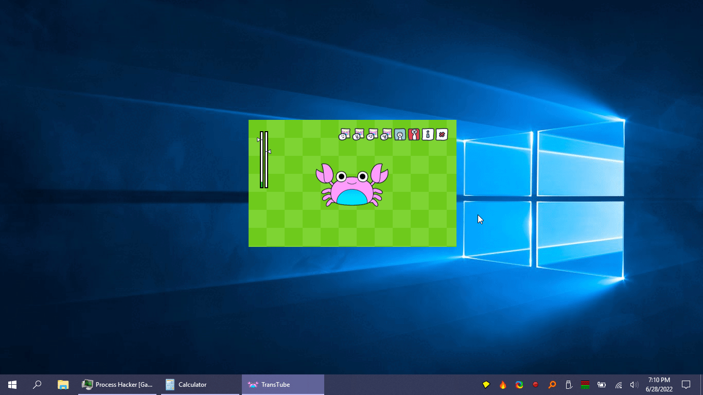

<h1 align="center">
  
   
   
</h1>

<h2 align="center">Simple vtuber app.</h2>
<h5 align="center"><i>Rework of <a href="https://veado.tube/">veadotube-mini</a></i></h5>

<h1 align="center">
  </a>  
</h1>

## Description

**TransTube** is a simple vtuber app that allows transparently overlaying your avatar on top of the screen.  

Transparency without the hassle of green screens!

It also switches your avatar depending on whether you're talking into the mic or not, and supports several built-in motion animations.

It is based on **<a href="https://veado.tube/">veadotube-mini**</a>.  Thanks to <a href="https://assetripper.github.io/AssetRipper/">**AssetRipper**</a>, some of the source code has been recycled.

Also uses code from **[arduino-audio-meter](https://github.com/quorauk/arduino-audio-meter)**.

## Dependencies

- [sciter.dll](https://gitlab.com/sciter-engine/sciter-js-sdk/-/blob/f149f104dcd7fd0db6ca8157acce10f060f03afc/bin/windows/x32/sciter.dll) v4.4.8.38