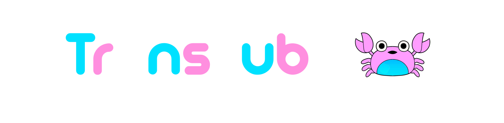
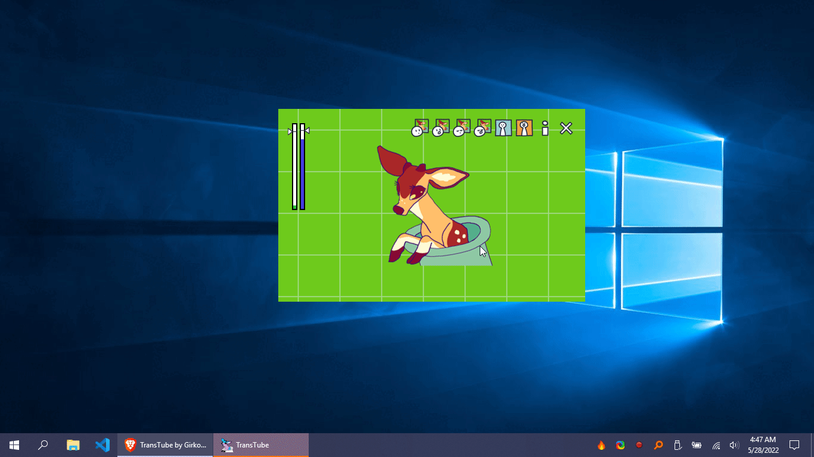

<h1 align="center">
  
   
   
</h1>

<h2 align="center">Simple vtuber app.</h2>
<h5 align="center"><i>Based on <a href="https://veado.tube/">veadotube-mini</a></i></h5>

<h1 align="center">
  </a>  
</h1>

## Description

**TransTube** is a simple vtuber app that allows transparently overlaying your avatar on top of the screen.  

Transparency without the hassle of green screens!

It also switches your avatar depending on whether you're talking into the mic or not, and supports several built-in motion animations.

It is based on **<a href="https://veado.tube/">veadotube-mini**</a>.  Thanks to <a href="https://assetripper.github.io/AssetRipper/">**AssetRipper**</a>, much of the source code and assets have been recycled.

The default deer avatar is named **Tube**, and was designed by <a href="https://twitter.com/bellaexclames">**bella!**</a>.

## Dependencies

- [sciter.dll](https://gitlab.com/sciter-engine/sciter-js-sdk/-/blob/f149f104dcd7fd0db6ca8157acce10f060f03afc/bin/windows/x32/sciter.dll) v4.4.8.38

## Terms of Use

unfortunately, due to the nature of the internet and the world, this page is a bit convoluted; there are a lot of shitty people out there who i’d rather not let consume the things we make.

to start off! **TransTube** is made with anti-capitalist ideals in mind. we use the anti-capitalist software license for our source code, and we’ll use it as a basis for this section.

so, to make it clear: you can use **TransTube** while earning money with it (the so-called “commercial use”). that’s how most of vtubing works, after all. this includes:

individuals labouring for themselves;
non-profit organisations;
educational institutions;
organisations that seek shared profit for all of its members, and allows non-members to set the cost of their labour.
but! if you’re an organisation, you can only use TransTube if:

in case you have owners, all of the owners are workers and all workers are owners with equal equity/vote;
you’re not law enforcement or military, or working for or under either.
you’re still here? great!

**TransTube** is made by trans, neurodivergent people who resorted to the internet during our teen years. because of that, we know how awful people on the internet can be, and we know the specific online groups that propagate such actions.

when we say we want to create something accessible so more people can join the fun, we also mean that we don’t want awful people ruining it.

with that said, if you apply as one of these, **TransTube** is not for you:

the usual bigot: racist, homophobic, transphobic, ableist, antisemitic, xenophobic;
a pedophile, or zoophile, or an enabler of any of these as well as incest;
a cop or military supporter;
a “TERF” or a “transmed”, which applies to transphobic;
a “pro-shipper”, which often means the things on item 2;
a cryptocurrency supporter, which includes “NFT”s.
if you’re not in there, congratulations! use **TransTube** as you like. otherwise, we may have to ban you from interacting with the community, as well as refund any purchases.